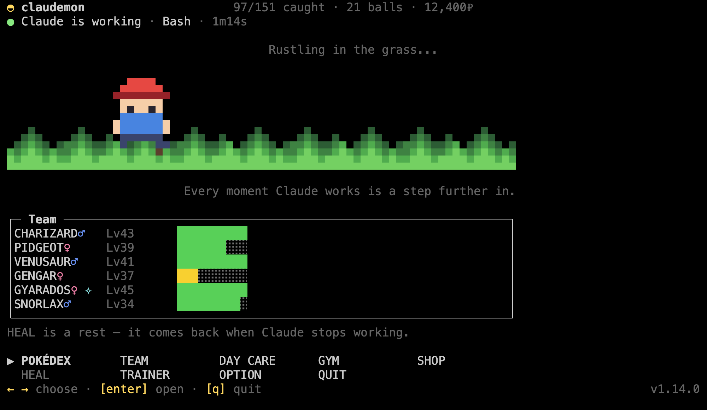
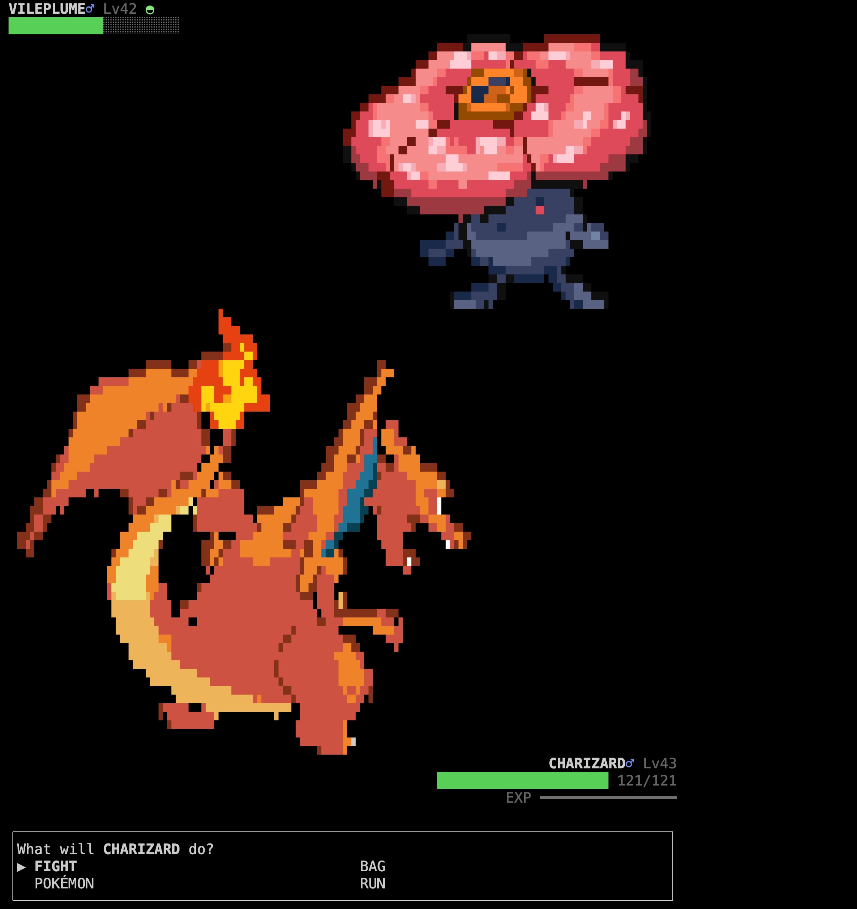
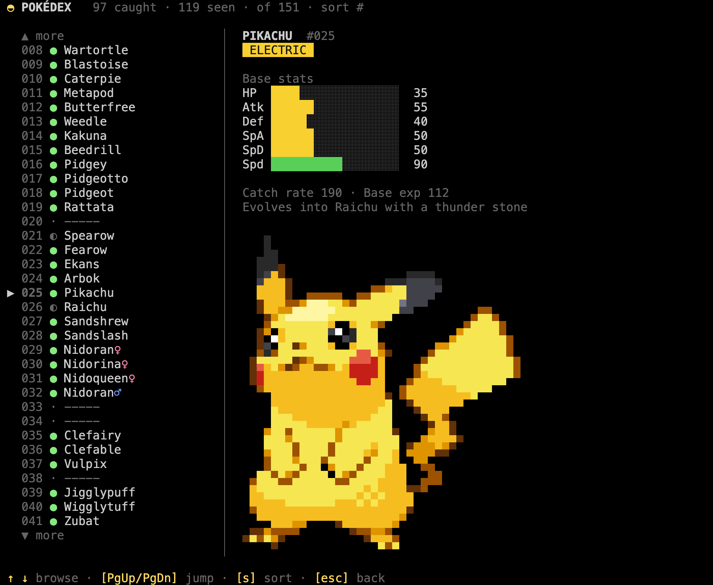
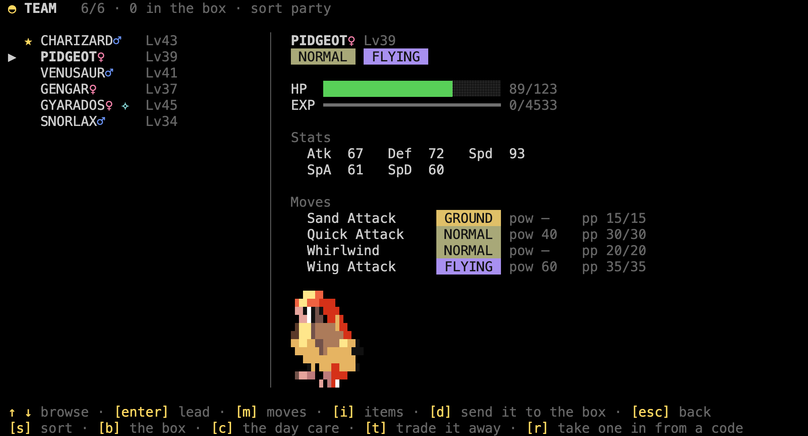

# claudemon

[](https://github.com/zamarrowski/claudemon/actions/workflows/ci.yml)

Wild Pokemon appear while you work in Claude Code. Your prompts are steps through
the grass: the longer the prompt, the further you walk, and the more chances
something jumps out. So is the waiting — every twenty seconds Claude spends
working is another step, because that is the half of the session you actually
have free.

The walking happens while Claude does, not the moment you press enter: a prompt
buys you the steps and the turn takes them, so anything that jumps out does it
with the grass already moving.

One at a time, and only for half a minute: a Pokemon that appears while you are busy
wanders off if you leave it there, so a long session never leaves a queue of battles
waiting for you.

The original 151. Fully local — no account, no backend, nothing about you leaving the
machine.

<table>
<tr>
<td width="58%" valign="top"></td>
<td width="42%" valign="top"></td>
</tr>
<tr>
<td valign="top">Waiting, which is most of it. The walk only moves while Claude does, so you can tell from across the desk without reading anything.</td>
<td valign="top">And when something does jump out.</td>
</tr>
</table>

It lives in a terminal tab of its own, next to the one you work in. The status line
in Claude tells you something is waiting; the game tab is where you go and fight it.

```
┌─ Terminal 1: claude ──────────────────────────────────┐
│ > refactor this component                             │
│ ███████░░░░░░░ 63% left | Opus 5                      │
│ ✦ A wild PIDGEY appeared!  ·  24s left  ·  claudemon  │
└───────────────────────────────────────────────────────┘
```

## Install

Typed inside Claude Code. Nothing to clone.

```
/plugin marketplace add zamarrowski/claudemon
/plugin install claudemon@claudemon
```

That puts the plugin in place — the hooks that make Pokemon appear come from it.

Now **restart Claude Code**. Claude Code only picks up a plugin's commands and hooks
at startup, so until you restart, the next line does not exist yet — if you type it
straight after installing, nothing happens. Once you are back:

```
/claudemon-setup
```

This does the rest: the `claudemon` command, the status line, and the sprites. It
prints a line per step and says so if one of them did not work.

Then two one-offs, which it reminds you of:

1. **Restart Claude Code** once more, so the new status line loads.
2. In a **second terminal tab**, run `claudemon`.

It asks for a name and a starter the first time, and after that it sits there
waiting. Send a longish prompt in the Claude tab and watch the status line.

### What you need first

| | How to check |
|---|---|
| **Claude Code** | You are already in it |
| **Node.js 20.19 or newer** | `node --version`. The game and the hooks run on it, and Claude Code ships as its own binary so it does not bring one. Nothing else to install — no dependencies, no build step |
| **A terminal with truecolor** | iTerm2, Ghostty, WezTerm, Kitty, Alacritty, VS Code's terminal and macOS Terminal are all fine |

The 151 Pokemon ship with the plugin, so the only thing the install downloads is the
sprites, which takes a few seconds. After that the only thing that ever goes out is
the version check below, and nothing goes out at all with it switched off.

### Updating

The version this is sits at the right-hand end of the home screen's bottom row. Once
a day the game asks GitHub whether a newer one is out — a plain `GET` of the plugin
manifest, about 300 bytes, sending nothing. If there is, the home screen says so:

```
◆ v0.7.0 is out · [u] update
```

`u` does it: it refreshes the marketplace, fetches the new version through
`claude plugin update`, and reruns the installer to catch anything around the plugin
that changed. Then two one-offs, which it tells you about — restart Claude Code so
the new hooks and status line load, and relaunch `claudemon`, because a running
process cannot swap its own code out.

**Option** says when that question gets asked. `UPDATE DAILY` is the default above.
`UPDATE LAUNCH` asks every time `claudemon` starts instead — one request as the tab
comes up, and none while you play, which is what you want if you leave a tab open for
a week and would rather not wait a day to hear about a release. `UPDATE OFF` stops it
entirely: nothing is offered and no socket is opened; the two commands under
**Coming from 0.5.0** below still work whenever you want them.

Updating through Claude Code instead is fine too. The `claudemon` command is kept
pointing at whichever copy is newest — by a hook, because neither the command nor the
status line can be rewritten by hand once they are on a PATH and in `settings.json` —
so the game picks the new one up on its next start, and says `◆ v0.7.0 is installed`
until you restart it.

#### Coming from 0.5.0

0.5.0 has none of this in it, so it cannot tell you a new version is out: the first
upgrade is the only one you do by hand. In a terminal — not at the Claude Code prompt,
because `/plugin` has no `update` of its own; this lives in the CLI:

```bash
claude plugin marketplace update claudemon
claude plugin update claudemon@claudemon
```

The first line is not optional. Your copy of the marketplace is whatever it was when
you added it, so without refreshing it the second line has nothing newer to find and
tells you so.

Restart Claude Code, then run `claudemon` again. That is all of it — the version turns
up in the bottom-right corner, and `[u]` does every upgrade after this one.

There is one thing 0.5.0 leaves behind that has to be undone, and it undoes itself.
0.5.0's installer wrote the directory it was installed from into both launchers and
nothing ever revisited it; for a plugin install that path has `0.5.0` in it, so the
command would go on starting 0.5.0 whatever else you installed — in silence, the only
symptom being a game that never changes. The first prompt after the restart puts both
right, and notes it in `~/.claudemon/claudemon.log`. A clone is left alone, because a
clone is meant to take precedence.

### Uninstall

```
/plugin uninstall claudemon@claudemon
```

That stops the hooks. To also remove the command and put your status line back, run
the installer's undo — from the plugin copy, before you uninstall it:

```bash
node "$CLAUDE_PLUGIN_ROOT/tools/install.mjs" --uninstall
```

Your save is left alone either way — delete `~/.claudemon/` as well to be rid of it.

### From a clone instead

For hacking on it, a clone works the same way and takes precedence over the
installed copy:

```bash
git clone https://github.com/zamarrowski/claudemon
cd claudemon
node tools/install.mjs
```

That does everything the steps above do, including installing the plugin from the
clone — so it needs no slash commands and only one restart, at the end. Keep the
directory where it is: the launcher prefers it while it exists.

Two checks, one floor — the 20.19 above, which is what `engines` says and what the
oldest leg of CI runs. `npm ci && npm test` puts the suite through Vitest; `npm ci &&
npm run lint` brings in the linter, which has opinions about correctness and none
about how the code looks. The game still has no runtime dependencies — everything
installed is a tool. The odd `.19` is the floor those tools share, and the two are
one number on purpose.

Installing also points git at `.githooks`, so a commit runs those checks before it is
written: the linter, Prettier, and one Vitest pass that is the suite and the coverage
floor at once — five seconds, near enough. It reads the working tree rather than the
index, so a half-staged change is checked as whatever is on disk, and `git commit
--no-verify` skips the lot when that is what you want.

[CONTRIBUTING.md](CONTRIBUTING.md) has the rest of it: the sprites the tests need,
previewing a screen without playing to it, and what a pull request is expected to
carry.

## Controls

Arrow keys move, `enter` confirms, `esc` goes back, `q` quits. Any key advances a
battle message. That is the whole scheme — it is the same everywhere.

| Screen | What it does |
|---|---|
| Home | Whatever is in the grass and how long is left to face it, your team, and the menu |
| Battle | FIGHT / BAG / POKÉMON / RUN, with move types, power and PP. The bag asks which of your team an item is for, so a Revive reaches somebody already down. A ◓ by the foe's name means it is already in your Pokédex |
| Pokédex | All 151, with how many of each you have faced, and base stats and evolution requirements for the ones you caught. `s` toggles sort between number and A–Z |
| Team | Details, moves, experience, `enter` to change your lead, and `d` to send one to the box. `s` sorts by party order or level. `i` opens the bag on whoever the cursor is on: a potion between fights, and the evolution stones, which are used nowhere else. A ✦ on the team list marks a mon that evolves by stone; `→N` is the level it evolves at. In the bag, a ✦ still marks an item that would evolve the selected mon |
| Box | Everything you caught with a full team, reached with `b` from the team screen. `s` sorts by catch order or level. `enter` takes one back into the team |
| Gym | The eight Kanto gyms, each one type, listed easiest first with the level range its trainers bring and the badge you have or have not won. `enter` walks in |
| Gym run | The gauntlet: two trainers and then the leader, back to back. Between fights you can move the cursor over your team, `l` to change your lead and `i` to reach the bag. There is no door back to the menu — `esc` twice walks out and undoes the whole run |
| Shop | Balls, potions, revives and evolution stones. `5` buys five |
| Option | How big sprites are drawn, the menu sounds, the bell, and when the version check runs — daily, every launch, or never. `← →` changes a setting, and the Pokémon underneath redraws as you do |

<table>
<tr>
<td width="50%"></td>
<td width="50%"></td>
</tr>
<tr>
<td><b>Pokédex</b> — seen and caught are tracked apart, and the stats fill in for the ones you caught.</td>
<td><b>Team</b> — <code>enter</code> changes which one leads.</td>
</tr>
</table>

## The trainer card

```bash
claudemon card
```

Writes `~/.claudemon/card.png` and opens it in whatever your desktop shows PNGs in —
Preview, the Photos viewer, an image viewer on Linux. Your six, drawn at the size
they deserve, over your name, the days you have been at it, the badges in the colour
of the type that gave them, and the hours Claude has spent working while you played.
It says where it came from along the bottom, so the picture carries its own link.

`--out somewhere.png` writes it elsewhere, and `--no-open` leaves the window shut,
which is what you want from a script.


The PNG is written by the game itself — the same pixel font and palette you see in
the terminal, encoded with nothing but `node:zlib`. No browser, no canvas library,
no dependency.

## What is in it

- The original 151, with real base stats, types, catch rates and Red/Blue movesets.
- Battles with critical hits, the type chart, status conditions, PP, one-hit KOs,
  fleeing and switching Pokémon mid-fight.
- Catching, where weakening and status genuinely help.
- Levelling, learning moves, and evolution by level or by stone.
- A Pokédex tracking seen and caught separately and counting how many of each you
  have faced, a team screen with the box behind it and the bag inside it, and a shop.
  Items are used on whoever you have picked, which is the only way a stone gets used
  at all.
- Eight gyms, one per type and ordered by difficulty, each a run of two trainers
  and then the leader with no way back to the menu in between. No shop and no rest
  in there: the potions you walk in with are the potions you get. Beat the leader
  and the badge is yours; lose, walk out or close the terminal and the whole run is
  undone — the experience, the money, the potions and the bruises, as if you had
  never gone in.
- A line telling you whether Claude is working, which tool it is on and for how
  long — and a bell when it finishes or gets stuck on a permission prompt, so the
  game tab is somewhere you can actually sit and wait.
- A patch of grass with someone walking through it, who only walks while Claude is
  working. Something you can catch out of the corner of your eye.
- HEAL greyed out for as long as Claude has the keyboard, and a blackout that leaves
  your team down rather than picking it up. Healing is a rest, and a rest is the half
  of the session Claude is not using — so a team (and the box) back at full health is
  something you pick up in the gaps, not something you farm between two tool calls.
- Blips as you move through the menus, a theme that plays from the first frame of a
  battle to the last, and a fanfare that takes over on the line that says you won or
  that the ball held — off in one place if you would rather work in silence. The blips
  are generated from a few lines of notes rather than shipped, so a new one costs three
  numbers; the two tracks are mono WAV in `assets/`, which is the one format every
  player on every platform will open.

## Contributing

Bugs and ideas go in [issues](https://github.com/zamarrowski/claudemon/issues/new/choose),
and there is a template for each. For code, [CONTRIBUTING.md](CONTRIBUTING.md) is the
place to start — how to set a clone up, the three commands that have to pass, and
what a pull request should carry. [CLAUDE.md](CLAUDE.md) is the house style behind
it, written for humans and agents alike, and it is what a review holds a change to.
[CODE_OF_CONDUCT.md](CODE_OF_CONDUCT.md) applies everywhere in the project, and
[SECURITY.md](SECURITY.md) is where a vulnerability goes instead of an issue.

## Credits

Data and Pokémon sprites come from [PokeAPI](https://pokeapi.co). The stats and
movesets in `data/` are built from it by `tools/fetch-data.mjs`. The trainer sprites
come from [Pokémon Showdown](https://play.pokemonshowdown.com/sprites/trainers/).
None of the sprites are in here: they are somebody else's artwork, so they are
downloaded at install time rather than redistributed.

`assets/battle.wav` is the trainer battle theme from the Game Boy games, trimmed to
two minutes and downmixed to mono; `assets/victory.wav` is the victory fanfare, given
the same treatment. Neither is original to this repo and neither is covered by the
LICENSE, which applies to the code.

Pokemon is a trademark of Nintendo, Creatures Inc. and GAME FREAK Inc.; this is a
personal, non-commercial toy.
